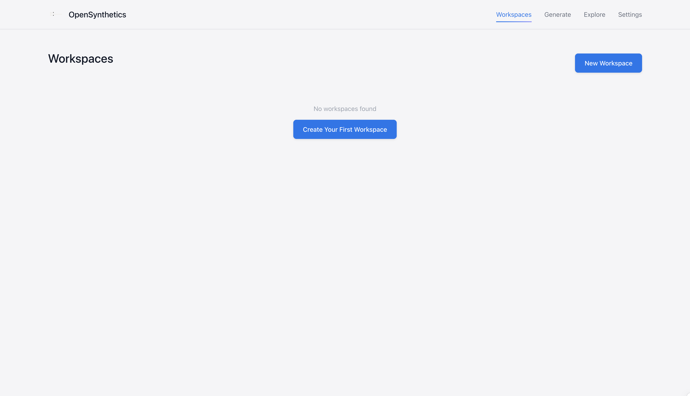

# OpenSynthetics

Advanced Synthetic Data Generation Platform for LLM fine-tuning, evaluation, and more.

## Overview

OpenSynthetics is a platform designed to help developers and researchers generate high-quality synthetic data for training, fine-tuning, and evaluating large language models. The platform provides:



- **Generation**: Various strategies for synthetic data generation
- **Storage**: Efficient data storage and management
- **Exploration**: Tools for exploring and analyzing generated data
- **API**: RESTful API for integration with other systems
- **CLI**: Powerful command-line interface for automation
- **UI**: Modern, Apple-inspired web interface for easy data management

## Installation

### Using pip

```bash
pip install opensynthetics
```

### From source

```bash
git clone https://github.com/llamasearchai/opensynthetics.git
cd opensynthetics
pip install -e .
```

## Quick Start

Set up your API keys for OpenAI or other LLM providers:

```bash
opensynthetics config set api_keys.openai your-api-key
```

Initialize a workspace:

```bash
opensynthetics init my_project
```

Generate some engineering problems:

```bash
opensynthetics generate run ~/opensynthetics_data/my_project \
  --strategy engineering_problems \
  --parameters-file params.json \
  --output-dataset mechanical_problems
```

Where `params.json` contains:

```json
{
  "domain": "mechanical",
  "count": 10,
  "difficulty": 5,
  "constraints": "The problems should involve static equilibrium and stress analysis."
}
```

Explore your data using Datasette:

```bash
opensynthetics datasette serve ~/opensynthetics_data/my_project
```

## Using the API

Start the API server:

```bash
opensynthetics api serve
```

The API will be available at http://localhost:8000 with documentation at http://localhost:8000/docs.

## Using the Web UI

Start the API server with the UI enabled:

```bash
opensynthetics api serve --host 0.0.0.0 --port 8000
```

Access the modern, Apple-inspired UI at http://localhost:8000/ui to:
- Create and manage workspaces
- Generate synthetic data with different strategies
- Explore datasets and their contents
- Configure API keys and system settings

## Documentation

For more detailed documentation, see:

- [Architecture](docs/architecture.md)
- [API Reference](docs/api-reference/index.md)
- [CLI Reference](docs/cli-reference.md)
- [Data Validation](docs/data_validation.md)
- [Development Guide](docs/development/index.md)

## License

MIT License

## Author

Nik Jois (nikjois@llamasearch.ai) 