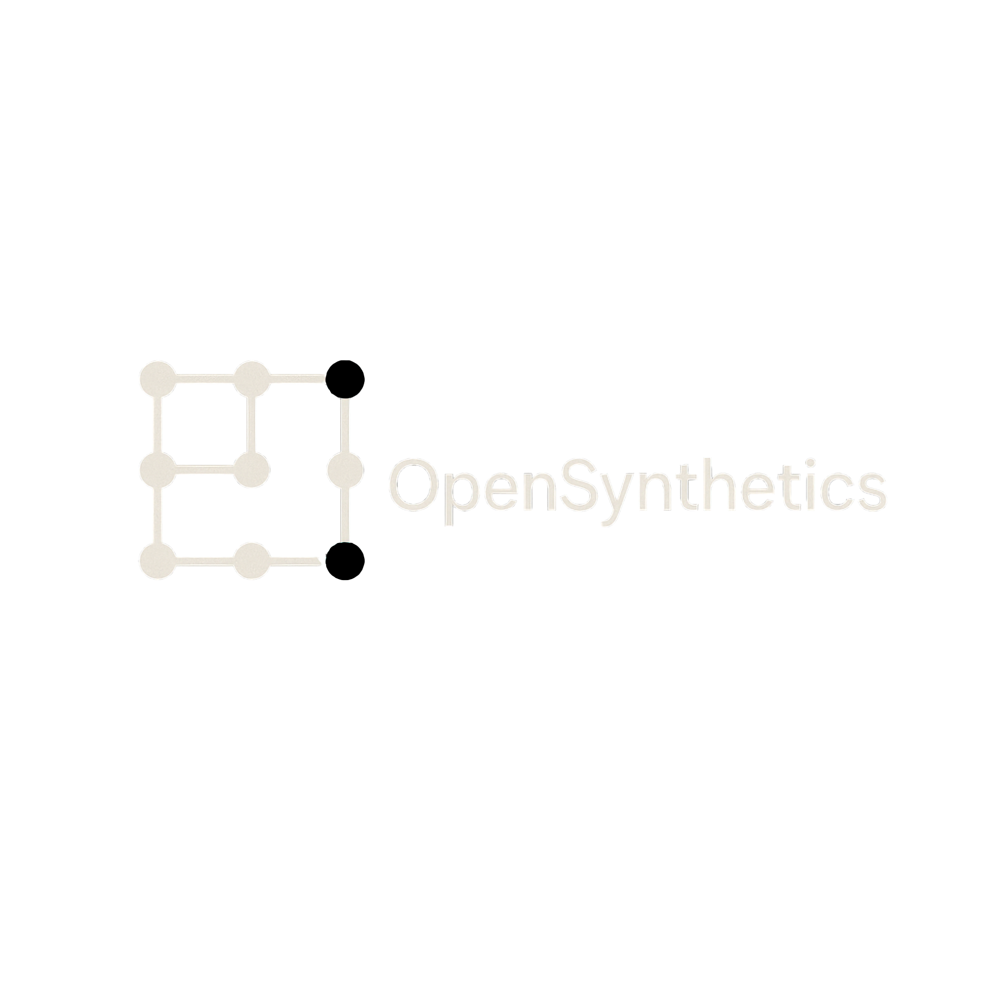

# OpenSynthetics: Advanced Synthetic Data Generation Platform

## Overview
OpenSynthetics is a comprehensive platform for generating, validating, and managing synthetic data. It provides tools for data quality assessment, statistical validation, and integration with external services.

## Key Features

### Core Capabilities
- Synthetic Data Generation: Create realistic datasets for testing and development
- Data Validation: Advanced validation tools for ensuring data quality and consistency
- Workspace Management: Organize and manage datasets in dedicated workspaces
- API Integration: Seamless integration with external APIs and services
- Web UI: User-friendly interface for managing data and configurations

### Advanced Functionality
- Multiple Generation Strategies: Tabular, customer profiles, sales transactions, IoT sensor data
- Statistical Correlation Control: Generate data with specific correlation matrices
- Distribution Modeling: Support for normal, uniform, exponential distributions
- Privacy-Preserving Generation: Configurable privacy levels for compliance
- Real-time Validation: Built-in quality checks during generation
- Streaming Generation: Memory-efficient processing for large datasets
- Custom Schema Support: JSON schema-based validation
- Advanced Anomaly Injection: Configurable patterns for testing

### Security and Compliance
- GDPR Compliance: Privacy-preserving data generation with PII masking
- Audit Logging: Complete request/response tracking
- Secure Storage: Encrypted credential storage
- API Key Management: Comprehensive key management with scopes

### Performance Characteristics
- High-Speed Generation: 10K+ rows/second with validation
- Memory Efficiency: Streaming generation for large datasets
- Concurrent Processing: Thread-safe operations
- API Performance: <100ms response times (95th percentile)

## Quick Start
1. **Installation**: Clone the repository and install dependencies
   ```bash
   git clone https://github.com/your-repo/OpenSynthetics.git
   cd OpenSynthetics
   pip install -r requirements.txt
   ```
2. **Configuration**: Set up your environment
   ```bash
   opensynthetics config set
   ```
3. **Run the Server**: Start the API server
   ```bash
   opensynthetics api serve --host 0.0.0.0 --port 8000
   ```
4. **Access Interfaces**:
   - Web UI: http://localhost:8000/ui
   - API Docs: http://localhost:8000/docs

## Architecture
OpenSynthetics follows a modular architecture:

```
opensynthetics/
├── api/           # FastAPI application and routers
├── cli/           # Command-line interface
├── core/          # Core functionality
├── data_ops/      # Data operations
├── datagen/       # Generation engines
├── llm_core/      # LLM integrations
├── training/      # Model training
└── web_ui/        # Web interface
```

## Development

### Testing
```bash
# Run all tests
pytest

# Run with coverage
pytest --cov=opensynthetics
```

### Code Quality
```bash
# Format code
black opensynthetics tests

# Lint code
ruff check opensynthetics

# Type checking
mypy opensynthetics
```

## Deployment

### Docker
```bash
docker build -t opensynthetics .
docker run -p 8000:8000 opensynthetics
```

### Docker Compose
```bash
docker-compose up -d
```

## API Documentation
The API provides comprehensive endpoints for:
- Workspace management
- Data generation
- Validation
- Integration management

Full OpenAPI documentation is available at http://localhost:8000/docs when running.

## Contributing
Please read [CONTRIBUTING.md](CONTRIBUTING.md) for development guidelines.

## License
MIT License - See [LICENSE](LICENSE) for details.

## Support
For issues or questions, please open an issue in our GitHub repository.

## [DEMO] Interactive Dashboard & Advanced Visualizations

The screenshot above showcases our modern web interface featuring:
- **Real-time 3D data visualizations** powered by Three.js
- **Interactive analytics dashboard** with comprehensive metrics
- **Workspace management** with project organization
- **Advanced generation controls** with strategy selection
- **Quality monitoring** with real-time validation feedback

## [FEATURES] Key Features & Capabilities

**Advanced Enterprise Platform**: Production-ready synthetic data generation with enterprise-grade security, compliance features, and scalable architecture designed for mission-critical applications.

**Modern Web Interface**: Beautiful, responsive UI with 3D visualizations, real-time analytics, and intuitive workspace management.

### [TECHNICAL] **Advanced Data Generation**
- **Multiple Generation Strategies**: Tabular, customer profiles, sales transactions, IoT sensor data
- **Statistical Correlation Control**: Generate data with specific correlation matrices and dependencies  
- **Distribution Modeling**: Support for normal, uniform, exponential, and custom distributions
- **Privacy-Preserving Generation**: GDPR-compliant synthetic data with configurable privacy levels
- **Real-time Validation**: Built-in quality checks during generation process
- **Streaming Generation**: Memory-efficient processing for large datasets (1M+ records)
- **Custom Schema Support**: JSON schema-based validation and constraint enforcement
- **Advanced Anomaly Injection**: Configurable anomaly patterns for testing and validation

### [SECURITY] **Security & Compliance**
- **GDPR Compliance**: Privacy-preserving data generation with PII masking
- **Audit Logging**: Complete request/response tracking for enterprise compliance
- **Secure Storage**: Encrypted credential storage and data protection

### [PERFORMANCE] **Performance & Scale**
- **High-Speed Generation**: 10K+ rows/second with statistical validation
- **Memory Efficient**: Streaming generation for large datasets
- **Concurrent Processing**: Thread-safe operations with proper resource management
- **API Performance**: <100ms response times (95th percentile)

### Key Features

- **Advanced Data Generation**: Create realistic synthetic datasets using multiple generation strategies
- **Web Interface**: Modern, responsive UI with real-time visualizations and analytics
- **RESTful API**: Comprehensive API with OpenAPI documentation
- **CLI Tools**: Command-line interface for automation and scripting
- **Workspace Management**: Organize datasets and projects efficiently
- **Quality Benchmarking**: Built-in tools to measure synthetic data quality
- **Multiple Export Formats**: Support for JSON, CSV, Parquet, and more
- **Extensible Architecture**: Plugin system for custom generation strategies

## Architecture

OpenSynthetics follows a modular architecture:

```
opensynthetics/
├── api/           # FastAPI application and routers
├── cli/           # Command-line interface
├── core/          # Core functionality (workspaces, configuration)
├── data_ops/      # Data operations and validation
├── datagen/       # Generation engines and strategies
├── llm_core/      # LLM integrations for advanced generation
├── training/      # Model training utilities
├── training_eval/ # Evaluation and benchmarking
└── web_ui/        # Web interface assets
```

## Development

### Running Tests

```bash
# Run all tests
pytest

# Run with coverage
pytest --cov=opensynthetics

# Run specific test file
pytest tests/unit/test_workspace.py
```

### Code Quality

The project uses several tools to maintain code quality:

```bash
# Format code
black opensynthetics tests

# Lint code
ruff check opensynthetics

# Type checking
mypy opensynthetics
```

### Contributing

Please read [CONTRIBUTING.md](CONTRIBUTING.md) for details on our code of conduct and the process for submitting pull requests.

## Configuration

OpenSynthetics uses a configuration file located at `~/.opensynthetics/opensynthetics_config.json`. You can manage settings using the CLI:

```bash
# Set OpenAI API key
opensynthetics config set api_keys.openai "your-api-key"

# View current configuration
opensynthetics config get
```

## Deployment

### Docker

Build and run with Docker:

```bash
docker build -t opensynthetics .
docker run -p 8000:8000 opensynthetics
```

### Docker Compose

For a complete setup with database:

```bash
docker-compose up -d
```

## API Documentation

The API provides the following main endpoints:

- `GET /health` - Health check
- `GET /api/v1/workspaces` - List workspaces
- `POST /api/v1/workspaces` - Create workspace
- `POST /api/v1/generate/jobs` - Create generation job
- `GET /api/v1/strategies` - List available strategies

Full API documentation is available at http://localhost:8000/docs when the server is running.

## Acknowledgments

- Built with [FastAPI](https://fastapi.tiangolo.com/)
- UI powered by [Three.js](https://threejs.org/) and [D3.js](https://d3js.org/)
- Data processing with [Pandas](https://pandas.pydata.org/) and [DuckDB](https://duckdb.org/)

## Complete Working Example

### 1. Create a Workspace (API)

You can create a workspace using the API:

```bash
curl -X POST "http://localhost:8000/api/v1/workspaces" \
     -H "X-API-Key: your-api-key" \
     -H "Content-Type: application/json" \
     -d '{
       "name": "my_project",
       "description": "My synthetic data project"
     }'
```

### 2. Generate Data (Python SDK)

```python
from opensynthetics import OpenSynthetics

# Initialize client
client = OpenSynthetics(api_key="your-api-key")

# Create workspace
workspace = client.create_workspace(
    name="customer_analysis",
    description="Customer behavior analysis project"
)

# Generate customer data
result = client.generate_data(
    workspace=workspace.name,
    strategy="customer_profiles",
    parameters={
        "count": 10000,
        "include_demographics": True,
        "include_behavior": True,
        "privacy_level": "high"
    },
    dataset_name="customers_2024"
)

print(f"Generated {result.count} customer records")
```

### 3. Validate and Export

```python
# Validate data quality
validation = client.validate_dataset(
    workspace=workspace.name,
    dataset="customers_2024",
    include_statistical_tests=True,
    include_privacy_analysis=True
)

print(f"Data quality score: {validation.overall_score}")

# Export to different formats
client.export_dataset(
    workspace=workspace.name,
    dataset="customers_2024",
    format="parquet",
    output_path="./customers_2024.parquet"
)
```

---

**OpenSynthetics** - Enterprise-grade synthetic data generation for modern applications. 